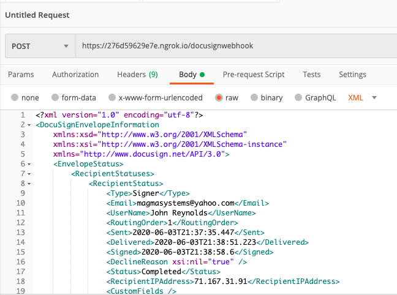

# DocuSign Development

## Creating a New DocuSign Application

The first thing that you need to do is to add a new application through the DocuSign admin console. Let's say that this application is called *Robyn*. Go to the API and Keys section of the eSignature console. Clicking on the yellow “Add App/Integration Key” button brings up a new page where you can specify the details of the new app.

<https://admindemo.docusign.com/api-integrator-key>


Name your new app. Fill in something for the terms, the privacy policy, and the redirect URI (they can be any values, but they cannot be empty).

You will need to create a new RSA Keypair. Make sure that you download the private key file that is created. You will need this private key in your C# code when you make the call to the Docusign authorization API.

Also, copy down your Integration Key. This is a GUID that you will need in your C# code when you make the call to the Docusign authorization API.


Now that the application is set up, we can start coding.

## Writing a Web App that uses DocuSign

We need to use a JWT authentication token for every request that we make to the DocuSign API. Before we make a call to the DocuSign API, we should call `ConfigureApiClientAuth(ApiClient apiClient)` in order to make sure that we have a valid token. The token will expire, so we need to refresh the token when it expires.

```cs
private static string AccessToken { get; set; }
private static DateTime ExpiresIn;

private void ConfigureApiClientAuth(ApiClient apiClient)
{
    this.CheckToken();
    apiClient.Configuration.AddDefaultHeader("Authorization", $"Bearer {AccessToken}");
}

private void CheckToken()
{
    if (AccessToken != null && DateTime.UtcNow <= ExpiresIn)
        return;

    this.UpdateToken();
}

private void UpdateToken()
{
    var clientId = this.Configuration["Docusign:clientId"];
    var impersonatedUserGuid = this.Configuration["Docusign:userId"];
    var authServer = this.Configuration["Docusign:authServer"];
    var privateKey = File.ReadAllBytes(this.Configuration["Docusign:privateKeyFile"]);

    var authToken = ApiClient.RequestJWTUserToken(
                clientId,
                impersonatedUserGuid,
                authServer,
                privateKey,
                1);

    AccessToken = authToken.access_token;
    if (authToken.expires_in != null)
        ExpiresIn = DateTime.UtcNow.AddSeconds(authToken.expires_in.Value);
}
```

As an example, here is a way that you can fetch the DocuSign template for the Robyn BAA.

The appsettings.json file has various configuration values that are associated with the DocuSign account.

In the constructor, we create the DocuSign `ApiClient`.

We will call the DocuSign API to list out all of the templates that our account owns. First, we make sure that we have a valid authentication token. Then we use the DocuSign TemplateAPI to get a list of the templates. Finally, we fetch the individual template.

```cs
private static ApiClient ApiClient { get; set; }

public DocusignController(ILogger<DocusignController> logger, IConfiguration config)
{
     this.Logger = logger;
     this.Configuration = config;

     var basePath = this.Configuration["Docusign:url"];
     ApiClient = new ApiClient(basePath);
}

public IActionResult Index()
{
    EnvelopeTemplate docusignTemplate = null;

    try
    {
        this.ConfigureApiClientAuth(ApiClient);

        var accountId = this.Configuration["Docusign:accountId"];
        var templatesApi = new TemplatesApi(ApiClient.Configuration);
        var templates = templatesApi.ListTemplates(accountId);

        foreach (var template in templates.EnvelopeTemplates)
        {
            docusignTemplate = template;
        }

        docusignTemplate = templatesApi.Get(accountId, docusignTemplate.TemplateId);
    }
    catch (Exception e)
    {
        this.Logger.LogError(e.Message);
        throw;
    }

    return View("Index", docusignTemplate);
}
```

## Using DocuSign Connect to Get Notifications

This is a simple Webhook that you can use to process the callbacks from DocuSign when certain interesting events happen. We take the XML that Docusign puts in the payload, and deserialize it into a custom class that we created. We take the important fields from this payload, and we create a small object that we can pass to other functions. We would probably want to look up the Robyn user by the email address, and we want to store the “TimeSigned” value into their user record in the database.

```cs
using System.Xml.Serialization;
using Microsoft.AspNetCore.Mvc;
using DocusignDemo.Models;

namespace DocusignDemo.Controllers
{
    [ApiController]
    [Route("[controller]")]
    public class DocusignWebhookController : ControllerBase
    {
        [HttpPost]
        public ActionResult<RobynDocumentSignedCompletetionInfo> Index()  
              // IMPORTANT: DO NOT USE AN ARGUMENT TO THIS FUNCTION
        {
            if (!(new XmlSerializer(typeof(DocuSignEnvelopeInformation)).Deserialize(Request.Body)
                      is DocuSignEnvelopeInformation envelopeInformation))
                return null;

            var documentSignedCompletetionInfo = new RobynDocumentSignedCompletetionInfo
            {
                Email = envelopeInformation.EnvelopeStatus.RecipientStatuses[0].RecipientStatus.Email,
                DocumentId = envelopeInformation.EnvelopeStatus.EnvelopeID,
                Status = envelopeInformation.EnvelopeStatus.Status,
                TimeSigned = envelopeInformation.EnvelopeStatus.Completed,
            };

            return documentSignedCompletetionInfo;
        }
    }
}
```

In the appsettings.Development.json file, we have some settings that are important to our example.

```json
"DocuSign":
{
    "authServer": "account-d.docusign.com",
    "url":        "https://demo.docusign.net/restapi",
    "accountId":  "[INSERT YOUR DOCUSIGN ACCOUNT ID HERE]",
    "clientId":   "[INSERT YOUR DOCUSIGN APP INTEGRATION KEY HERE]",
    "userId":     "[INSERT YOUR DOCUSIGN USER ID HERE]",
    "privateKeyFile": "Docusign.RSA.privatekey.txt",
}
```

## Running the App and Using the Webhook

Go into your Terminal on your laptop, and start ngrok like this:

`ngrok http https://localhost:5001`

You will see ngrok respond with a message like this:

```shell
ngrok by @inconshreveable                                                                                                                       (Ctrl+C to quit)

Session Status                online
Account                       Marc Adler (Plan: Free)
Version                       2.3.35
Region                        United States (us)
Web Interface                 http://127.0.0.1:4040
Forwarding                    http://276d59629e7e.ngrok.io -> https://localhost:5001
Forwarding                    https://276d59629e7e.ngrok.io -> https://localhost:5001
Connections                   ttl     opn     rt1     rt5     p50     p90
                              0       0       0.00    0.00    0.00    0.00
```

Pay attention to the line that says:

<https://276d59629e7e.ngrok.io> -> <https://localhost:5001>

You will need to tell the DocuSign admin console that <https://276d59629e7e.ngrok.io> is the server where your webhook is. Note that this address will change every time that you restart ngrok.

You have to go into the DocuSign Connect dashboard, highlight the Robyn application, and change the URL of the webhook to the server that ngrok printed out.

---


---


---

If you want to monitor the messages that ngrok processes, go into Chrome and go to `localhost:4040`.

Let’s say that the webhook can be reached at <https://276d59629e7e.ngrok.io/DocusignWebhook>

You can test the webhook using Postman:



If you have a breakpoint set at the webhook, the breakpoint should be hit. Also, the message should be seen in the ngrok console on Chrome (`localhost:4040`).

Now you can try DocuSign. Run your sample app, send out a document to be signed, wait for the recipient to sign it, and wait for the webhook to be called.
